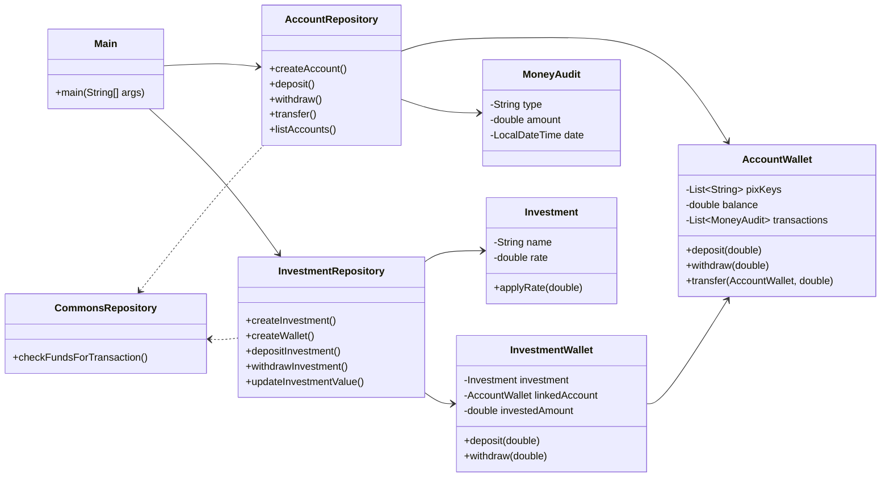

# Projeto-BankJava
Projeto realizado seguindo o curso da DIO de java orientada a objetos. Neste projeto realizei a criação de uma interface de um banco.


# 💰 Nexu Bank – Sistema Bancário em Java

##  Sobre o Projeto

O **Nexu Bank** é um sistema bancário desenvolvido em **Java**, com o objetivo de aplicar conceitos de **Programação Orientada a Objetos (POO)**, **tratamento de exceções**, **organização em camadas** e **simulação de operações financeiras reais**.

O projeto simula um **banco digital completo**, com contas, transferências, carteiras de investimento e histórico de movimentações.

---

##  Estrutura do Projeto

```
📦 br.com.dio
 ┣ 📜 Main.java
 ┣ 📂 model
 ┃ ┣ 📜 AccountWallet.java
 ┃ ┣ 📜 Investment.java
 ┃ ┣ 📜 InvestmentWallet.java
 ┃ ┗ 📜 MoneyAudit.java
 ┣ 📂 repository
 ┃ ┣ 📜 AccountRepository.java
 ┃ ┣ 📜 InvestmentRepository.java
 ┃ ┗ 📜 CommonsRepository.java
 ┗ 📂 expcetion
    ┣ 📜 AccountNotFoundException.java
    ┣ 📜 NoFundsEnoughException.java
    ┣ 📜 AccountWithInvestmentException.java
    ┣ 📜 PixinUserException.java
    ┗ 📜 WalletNotFoundException.java
```

---

## Funcionalidades

| Opção | Descrição                                            |
| :---- | :--------------------------------------------------- |
| 1     | Criar nova conta com múltiplas chaves PIX            |
| 2     | Criar investimento (definindo taxa e valor inicial)  |
| 3     | Criar carteira de investimento vinculada a uma conta |
| 4     | Realizar depósito                                    |
| 5     | Realizar saque                                       |
| 6     | Transferir entre contas                              |
| 7     | Investir valores da conta                            |
| 8     | Sacar valores do investimento                        |
| 9     | Listar contas cadastradas                            |
| 10    | Listar investimentos disponíveis                     |
| 11    | Listar carteiras de investimento                     |
| 12    | Atualizar rendimentos                                |
| 13    | Exibir histórico de movimentações                    |
| 14    | Encerrar o programa                                  |

---

##  Diagrama UML do Sistema



 **Interpretação:**

* `Main` é o ponto de entrada, interage com o usuário e chama os repositórios.
* `AccountRepository` e `InvestmentRepository` são os controladores de regras de negócio.
* `AccountWallet` e `InvestmentWallet` são os modelos (entidades).
* `CommonsRepository` fornece métodos auxiliares usados por ambos os repositórios.
* `MoneyAudit` registra todas as movimentações financeiras.

---

##  Principais Classes

### 🔹 `Main.java`

Gerencia a interface do usuário via terminal (`Scanner`), exibindo o menu e capturando entradas.
Responsável por:

* Chamar os métodos de cada repositório.
* Tratar exceções com `try/catch`.
* Controlar o fluxo do programa.

### 🔹 `AccountRepository.java`

Gerencia **contas bancárias**:

* Criação de contas com múltiplas chaves PIX.
* Depósitos, saques e transferências.
* Retorno do histórico (`MoneyAudit`).
* Verificação de saldo.

### 🔹 `InvestmentRepository.java`

Gerencia **investimentos e carteiras**:

* Criação e vinculação de investimentos a contas.
* Atualização de valores conforme taxa.
* Depósitos e retiradas de valores.

### 🔹 `AccountWallet` / `InvestmentWallet`

Modelos que armazenam dados de **saldo, PIX, movimentações e investimento vinculado**.
Permitem registrar transações automaticamente com o objeto `MoneyAudit`.

---

## Exceções Personalizadas

| Exceção                          | Descrição                            |
| :------------------------------- | :----------------------------------- |
| `AccountNotFoundException`       | Conta não encontrada pelo PIX        |
| `NoFundsEnoughException`         | Saldo insuficiente                   |
| `PixinUserException`             | PIX já em uso                        |
| `WalletNotFoundException`        | Carteira de investimento inexistente |
| `AccountWithInvestmentException` | Conta já possui investimento ativo   |

Essas exceções tornam o código mais claro e seguro, evitando erros silenciosos.

---

##  Pilares de POO Aplicados

| Pilar              | Aplicação                                                   |
| :----------------- | :---------------------------------------------------------- |
| **Abstração**      | Separação em classes específicas para cada responsabilidade |
| **Encapsulamento** | Atributos privados com métodos de acesso controlados        |
| **Herança**        | Estrutura de repositórios reutilizáveis                     |
| **Polimorfismo**   | Métodos que mudam de comportamento conforme o contexto      |

---

## Tecnologias Utilizadas

* ☕ **Java 17+**
* 💻 **Paradigma POO**
* 🧠 **Streams API**
* 💬 **Scanner (entrada via terminal)**
* ⚡ **Tratamento de exceções**
* 🗂️ **Coleções (`List`, `Map`)**

---

##  Aprendizado Obtido

Durante o desenvolvimento do Nexu Bank, foram reforçados diversos conceitos fundamentais:

* Modelagem de **sistemas bancários reais** com múltiplas entidades.
* Uso de **Streams API** para manipulação de coleções.
* Implementação de **tratamento de exceções customizadas**.
* Aplicação prática de **encapsulamento, abstração e modularidade**.
* Organização do código em **camadas e pacotes funcionais**.
* Uso de **listas, mapas e estruturas de dados dinâmicas**.
* Criação de **um sistema totalmente funcional em memória** (sem banco de dados).

---

## Autor

**Leonel Zaninelli de Souza**
📚 Desenvolvedor em formação |Backend: Python e Java **Java, POO e sistemas inteligentes**
Projeto criado para consolidar conceitos de **arquitetura e boas práticas em Java**.

---

## Licença

Este projeto é **de uso educacional** e pode ser livremente adaptado para fins de aprendizado.

